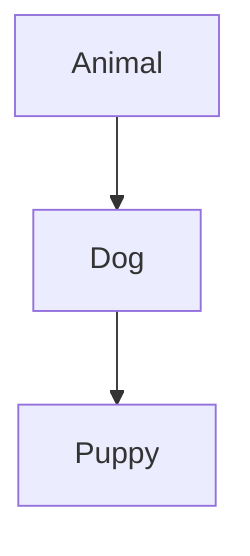

# Assignment 1 - C# and Dotnet Tools

## Due Date: 04th Nov 2024 

### 1. List the Client Scripting Languages? Explain?
Client scripting languages are programming languages that run in a user's web browser, allowing for dynamic interaction with web pages. They enable developers to create responsive, interactive experiences without needing to constantly communicate with the server. Here are some of the most common client scripting languages:

1. **JavaScript**:
   - **Description**: JavaScript is the most widely used client-side scripting language. It allows developers to create interactive elements on web pages, such as form validation, animations, and dynamic content updates without needing to reload the page.
  <!-- - **Key Features**: 
     - Event-driven programming
     - Support for AJAX for asynchronous web requests
     - Extensive libraries and frameworks (like React, Angular, and Vue.js) -->

2. **HTML (with embedded scripts)**:
   - **Description**: While HTML itself is not a programming language, it is essential for structuring web content. Client-side scripts, often JavaScript, are embedded within HTML documents to enhance functionality.
  <!-- - **Key Features**: 
     - Structure and presentation of web content
     - Integration with CSS for styling and JavaScript for interactivity -->

3. **CSS (with animations)**:
   - **Description**: Cascading Style Sheets (CSS) is primarily used for styling web pages but can also include animations and transitions that enhance user interaction.
  <!-- - **Key Features**: 
     - Responsive design capabilities
     - CSS animations and transitions to create visual effects -->

4. **VBScript**:
   - **Description**: VBScript is a scripting language developed by Microsoft, primarily used in Internet Explorer. It's less common today due to the decline of IE and the rise of standards like JavaScript.
 <!--  - **Key Features**: 
     - Integration with Windows applications
     - Limited use due to compatibility issues with modern browsers -->

5. **TypeScript**:
   - **Description**: TypeScript is a superset of JavaScript that adds static typing. It is compiled to JavaScript, allowing developers to catch errors at compile time and improve code maintainability.
  <!-- - **Key Features**: 
     - Strongly typed language
     - Supports modern JavaScript features and additional tooling -->

6. **Dart**:
   - **Description**: Dart is an open-source language developed by Google, primarily used for building mobile, desktop, and web applications. It can be compiled to JavaScript for client-side use.
   <!--- **Key Features**: 
     - Strong typing and modern language features
     - Used with the Flutter framework for building cross-platform applications -->


### 2. What is .NET Framework?
.NET Framework is a software development framework for building and running applications on Windows. [(1)](https://dotnet.microsoft.com/en-us/learn/dotnet/what-is-dotnet-framework) It's developed by Microsoft providing a runtime environment and a set of libraries and tools for building and running applications on Windows operating systems. The framework includes a variety of programming languages, such as C#, F#, and Visual Basic, and supports a range of application types, including desktop, web, mobile, and gaming applications. [(2)](https://www.geeksforgeeks.org/introduction-to-net-framework/)


### 3. What is VB.NET?
The VB.NET stands for Visual Basic. Network Enabled Technologies. Visual Basic is an object-oriented programming language developed by Microsoft. Using Visual Basic makes it fast and easy to create type-safe .NET apps. [(1)](https://learn.microsoft.com/en-us/dotnet/visual-basic/) It is a multi-paradigm, object-oriented programming language, implemented on .NET, Mono, and the .NET Framework. The VB.NET language is designed in such a way that any new beginner or novice and the advanced programmer can quickly develop a simple, secure, robust, high performance of web, windows, console, and mobile application running on .NET Framework. [(2)](https://www.javatpoint.com/vb-net)

### 4. Explain the Web Technologies with example?
Web Technology refers to the various tools and techniques that are utilized in the process of communication between different types of devices over the Internet. A web browser is used to access web pages. Web browsers can be defined as programs that display text, data, pictures, animation, and video on the Internet. Hyperlinked resources on the World Wide Web can be accessed using software interfaces provided by Web browsers. [(1)](https://www.geeksforgeeks.org/web-technology/)
- **HTML (HyperText Markup Language)**
    - HTML is the standard markup language for creating web pages. It structures the content on the page.
- **CSS (Cascading Style Sheets)**
    - CSS is used to style HTML elements, allowing developers to change the look and feel of a website.
- **JavaScript**
    - JavaScript is a programming language that enables interactive web pages. It runs in the browser and can manipulate HTML and CSS.
- **Front-End Frameworks**
    - Frameworks like React, Angular, and Vue.js help build dynamic user interfaces by simplifying the development process.
- **Back-End Technologies**
    - Back-end technologies handle server-side operations. Examples include Node.js, Python (with Flask or Django), Ruby on Rails, and PHP.
- **Databases**
    - Databases store and manage data for web applications. Common types include relational databases (like MySQL, PostgreSQL) and NoSQL databases (like MongoDB).


### 5. Explain the Advantages and Disadvantages of Client-side and Server-side Technologies
- #### **Client-side**
    - Advantages
        - Allow for more interactivity by immediately responding to users’ actions.
        - Execute quickly because they do not require a trip to the server.
        - Are reusable and obtainable from many free resources.
        <!-- - May improve the usability of Web sites for users whose browsers support scripts. -->
        <!-- - Can give developers more control over the look and behaviour of their Web widgets. -->

    - Disadvantages
        - Not all browsers support scripts, therefore, users might experience errors if no alternatives have been provided.
        - Different browsers and browser versions support scripts differently, thus more quality assurance testing is required.

- #### **Server-side scripts**
    - Advantages
        - User can create one template for the entire website
        - Generally quicker to load than client-side scripting
        - User is able to include external files to save coding.
        - User does not need to download plugins like Java or Flash.
        <!-- - The site can use a content management system which makes editing simpler. -->
        <!-- - Scripts are hidden from view so it is more secure. Users only see the HTML output. -->

    - Disadvantages
        - Many scripts and content management systems tools require databases in order to store dynamic data.
        - It requires the scripting software to be installed on the server.
        <!-- The nature of dynamic scripts creates new security concerns, in some cases making it easier for hackers to gain access to servers exploiting code flaws. -->

### 6. Explain the C# Tokens with one example for each

A c# program is basically collection of tokens.

There are five tokens in C#.
- Keywords
    - These are reserved words which are saved for existing things by the language.
    - Example: event, extern, null, etc
- Identifiers
    - Identifier is a name that we give to objects, classes, methods, variables, etc to identify them.
    - Example: hello, a, b, variable1, etc
- Literals
    - Literals are how values in a variable are shown. 
    - Types:
        - Numeric literal
            - Integer literal
            - Real literal
        - Boolean Literal
        - Character Literal
            - Character Literal
            - String literal
        - Example: true is a boolean literal
- operators
    - Operators are symbols used to describe operations between one or more operands
    - Example: + for addition
- punctuators.
    - These are used to seperate, group and format the code.
    - They help in defining the shape of the program
    - Also Known as Seperators
    - Example: ; (semicolon)

[MSDotnet.co.in](https://www.msdotnet.co.in/2013/06/tokens-in-c.html)

### 7. Explain the OOP Concept in C#.

C# is an object-oriented programming language. The four basic principles of object-oriented programming are:
- Abstraction:
    - Modeling the relevant attributes and interactions of entities as classes to define an abstract representation of a system.
- Encapsulation:
    - Hiding the internal state and functionality of an object and only allowing access through a public set of functions.
- Inheritance:
    - Ability to create new abstractions based on existing abstractions.
- Polymorphism
    - Ability to implement inherited properties or methods in different ways across multiple abstractions.

[Microsoft Learn](https://learn.microsoft.com/en-us/dotnet/csharp/fundamentals/tutorials/oop)
### 8. Define Inheritance and write the types with neat diagram and explain one program

Inheritance is an OOP Concept where we define a class based on another class while bringing over the properties and more from the previous class.

In C#, there are 4 types of inheritance:
- Single inheritance: 
    - A derived class that inherits from only one base class.
    ```mermaid
    graph TD;
    A[BaseClass] --> B[DerivedClass]
    ```
- Multi-level inheritance: 
    - A derived class that inherits from a base class and the derived class itself becomes the base class for another derived class.
    ```mermaid
    graph TD;
    A[BaseClass] --> B[DerivedClass1]
    B --> C[DerivedClass2]
    ```
- Hierarchical inheritance: 
    - A base class that serves as a parent class for two or more derived classes.
    ```mermaid
    graph TD;
    A[BaseClass] --> B[DerivedClass1]
    A --> C[DerivedClass2]
    A --> D[DerivedClass3]
    ```
- Multiple inheritance: 
    - A derived class that inherits from two or more base classes.
    ```mermaid
    graph TD;
    A[BaseClass1] --> D[DerivedClass]
    B[BaseClass2] --> D[DerivedClass]
    ```

Program:
```C#
using System;

// Base class
class Animal {
    public void Speak() {
        Console.WriteLine("Animal speaks");
    }
}

// Derived class (Single Inheritance)
class Dog : Animal {
    public void Bark() {
        Console.WriteLine("Dog barks");
    }
}

// Derived class (Multi-level Inheritance)
class Puppy : Dog {
    public void Whine() {
        Console.WriteLine("Puppy whines");
    }
}

class Program {
    static void Main() {
        Puppy puppy = new Puppy();
        puppy.Speak(); // Inherited from Animal
        puppy.Bark();  // From Dog
        puppy.Whine(); // From Puppy
    }
}
```



- **Animal** is the base class.
- **Dog** inherits from **Animal** (Single Inheritance).
- **Puppy** inherits from **Dog** (Multi-level Inheritance).

[GeeksForGeeks](https://www.geeksforgeeks.org/c-sharp-inheritance/)
### 9. Explain the control structures with syntax and flow chart

C# offers three types of control statements:

- Selection Statements 
    - This consists of if, else, switch, and case branching.
- Iteration Statements 
    - This consists of do, for, foreach, and while looping.
- Jump Statements  
    - This consists of break, continue, return, and goto statements.

TODO: explanation and programs

[FreeASPHosting](https://freeasphosting.net/csharp-tutorial-control-statements.html)
### 10. List the data types of C# programming
| Data Type | Size | Description |
|--|--|--|
| int| 4 bytes | Stores whole numbers from -2,147,483,648 to 2,147,483,647|
| long  | 8 bytes | Stores whole numbers from -9,223,372,036,854,775,808 to 9,223,372,036,854,775,807|
| float | 4 bytes | Stores fractional numbers. Sufficient for storing 6 to 7 decimal digits|
| double | 8 bytes | Stores fractional numbers. Sufficient for storing 15 decimal digits|
| bool | 1 bit | Stores true or false values|
| char | 2 bytes | Stores a single character/letter, surrounded by single quotes|
| string | 2 bytes per character | Stores a sequence of characters, surrounded by double quotes|

[Geeks For Geeks](https://www.w3schools.com/cs/cs_data_types.php) 
### 11. Explain the different types of lists tags with example program

### 12. Explain types of operators with example of each

### 13. What is the difference between client side and server-side programming?

### 14. List the features of C# and explain

### 15. List the features of VB.NET and explain

### 16. Write a basic structure of an HTML program

### 17. List the different types of languages supported in .NET Framework

### 18. Define try and catch block with an example program

### 19. Explain different types of arrays in c#

### 20. Explain Mutable and Immutable strings in c#

### 21. Explain about Interfaces 

## Source:
- Questions - given by faculty
