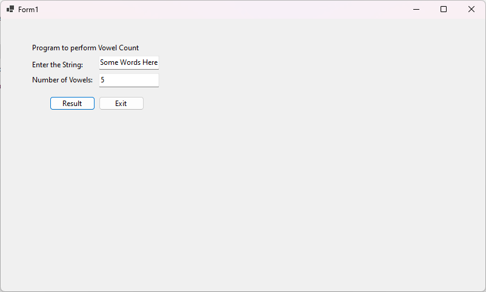
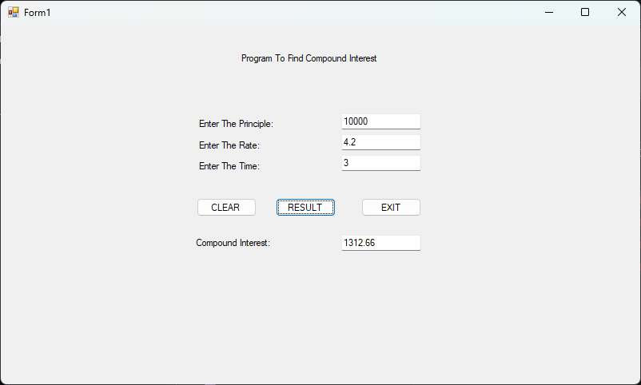
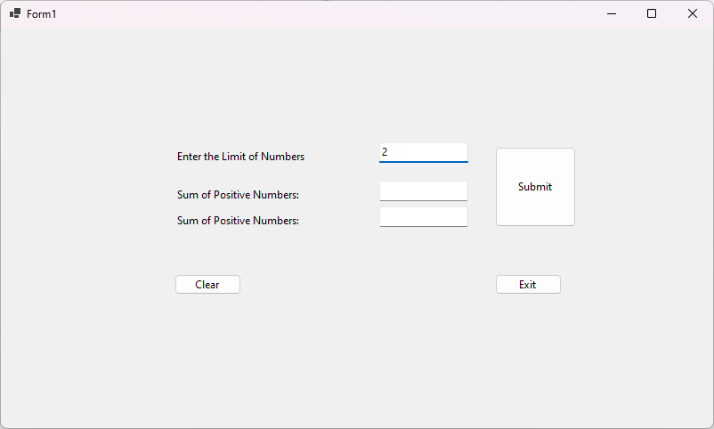
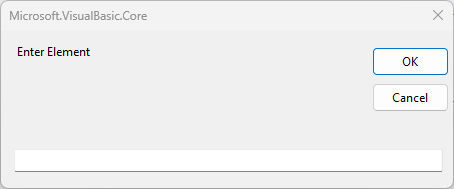
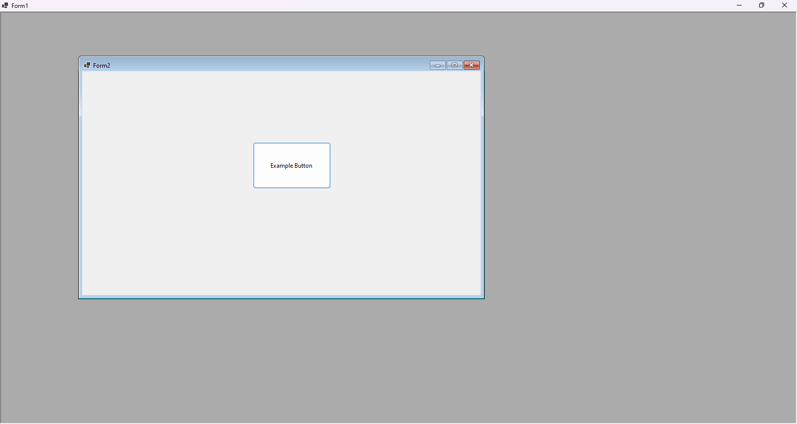

# Lab Practicals
## Part B
### Program 1 - VB.NET Program to count the number of Vowels

```vbnet
Public Class Form1
    Private Sub Button1_Click(sender As Object, e As EventArgs) Handles Button1.Click
        Dim str1, str2
        Dim vcount, i, str1len As Integer

        str1 = TextBox1.Text
        str1len = Len(str1)
        For i = 1 To str1len
            str2 = Mid(str1, i, 1)
            If str2 = "a" Or str2 = "e" Or str2 = "i" Or str2 = "o" Or str2 = "u" Or str2 = "A" Or str2 = "E" Or str2 = "I" Or str2 = "O" Or str2 = "U" Then
                vcount = vcount + 1
            End If
        Next
        TextBox2.Text = vcount
    End Sub

    Private Sub Button2_Click(sender As Object, e As EventArgs) Handles Button2.Click
        Close()
    End Sub
End Class
```



[Source](https://github.com/sounddrill31/VowelCountApp/blob/main/source/VowelCountApp/Form1.vb)

[Download Output](https://github.com/sounddrill31/VowelCountApp/releases/download/12115653768/VowelCountApp-windows-latest-12115653768.zip)
### Program 2 - VB.NET Program to check if number is Odd or Even
```vbnet
Public Class Form1
    Private Sub TextBox1_TextChanged(sender As Object, e As EventArgs) Handles Value.TextChanged
        If Value.Text = Nothing Then
            Label1.Text = "Enter Number"
        Else
            Dim ValueNum As Integer = Value.Text
            If (ValueNum Mod 2 = 0) Then
                Label1.Text = "Even - Enter Value"
            Else
                Label1.Text = " Odd - Enter Value"
            End If
        End If
    End Sub

    Private Sub ClrButton_Click(sender As Object, e As EventArgs) Handles ClrButton.Click
        Label1.Text = "Enter Number"
        Value.Text = String.Empty
    End Sub

    Private Sub ExitButton_Click(sender As Object, e As EventArgs) Handles ExitButton.Click
        Close()
    End Sub
End Class
```


[Source](https://github.com/sounddrill31/OddEvenApp_Winforms/blob/main/Form1.vb)

[Download Output](https://github.com/sounddrill31/OddEvenApp_Winforms/releases/download/12116520828/OddEvenApp_Winforms-windows-latest-12116520828.zip)
### Program 3 - VB.NET Program to calculate compound interest
```vbnet
Public Class Form1
    Private Sub Button1_Click(sender As Object, e As EventArgs) Handles Button1.Click
        Dim P, N As Integer
        Dim R As Double
        P = TextBox1.Text
        R = TextBox2.Text
        N = TextBox3.Text
        TextBox4.Text = Math.Round(((P * (1 + (R / 100)) ^ N - 1) - P), 2)
    End Sub

    Private Sub Button3_Click(sender As Object, e As EventArgs) Handles Button3.Click
        TextBox1.Text = ""
        TextBox2.Text = ""
        TextBox3.Text = ""
    End Sub

    Private Sub Button2_Click(sender As Object, e As EventArgs) Handles Button2.Click
        Close()
    End Sub
End Class
```


[Source](https://github.com/Jack-Pots/CompoundInterest/blob/main/CI/Form1.vb)

Download Output
### Program 4 - VB.NET Program to display the sum of negative and sum of positive numbers 
```vbnet
Public Class Form1
    Private Sub Button1_Click(sender As Object, e As EventArgs) Handles Button1.Click

        Dim Limit As Integer = Integer.Parse(LimitN.Text)
        Dim arr(Limit) As Integer
        Dim p_n = 0
        Dim n_n = 0


        For i As Integer = 0 To (Limit - 1)
            Dim temp As String = InputBox("Enter Element")
            If (Integer.Parse(temp) >= 0) Then
                p_n = p_n + Integer.Parse(temp)
            Else
                n_n = n_n + Integer.Parse(temp)
            End If
        Next i

        PositiveSum.Text = p_n
        NegativeSum.Text = n_n
    End Sub

    Private Sub Button2_Click(sender As Object, e As EventArgs) Handles Button2.Click
        ' clear the screen
        LimitN.Text = String.Empty
        PositiveSum.Text = String.Empty
        NegativeSum.Text = String.Empty
    End Sub

    Private Sub Button3_Click(sender As Object, e As EventArgs) Handles Button3.Click
        ' Exit program
        Close()
    End Sub
End Class
```




[Source](https://github.com/sounddrill31/SumNum_Winforms/blob/main/SumNum/Form1.vb)

[Download Output](https://github.com/sounddrill31/SumNum_Winforms/releases/download/11983858383/SumNum-windows-latest-11983858383.zip)
### Program 5 - VB.NET Program to concat 2 strings
```vbnet
Public Class Form1
    Private Sub Result_Click(sender As Object, e As EventArgs) Handles Result.Click
        ResultBox.Text = FirstNameBox.Text & " " & LastNameBox.Text
    End Sub

    Private Sub exitBtn_Click(sender As Object, e As EventArgs) Handles exitBtn.Click
        Close()
    End Sub

    Private Sub Clear_Click(sender As Object, e As EventArgs) Handles Clear.Click
        FirstNameBox.Text = String.Empty
        LastNameBox.Text = String.Empty
        ResultBox.Text = "Result"
    End Sub
End Class
```


[Source](https://github.com/sounddrill31/Concat2Strings_WinForms/blob/main/Concat2Strings/Form1.vb)

[Download Output](https://github.com/sounddrill31/Concat2Strings_WinForms/releases/download/12115871070/Concat2Strings-windows-latest-12115871070.zip)
### Program 6 - VB.NET Program to change the styles and fonts of Text
### Program 7 - VB.NET Program to generate student enrollment details
### Program 8 - VB.NET Program to demonstrate MDI parent forms
```vbnet
Public Class Form1
    Private Sub Form1_Load(sender As Object, e As EventArgs) Handles MyBase.Load
        Form1.IsMdiContainer = True
        Form2.MdiParent = Me
        Form2.Show()
    End Sub
End Class
```



[Source](https://github.com/sounddrill31/MDIFormsExample_Winforms/blob/main/Form1.vb)

[Download Output](https://github.com/sounddrill31/MDIFormsExample_Winforms/releases/download/12080036688/MDIFormsExample-windows-latest-12080036688.zip)