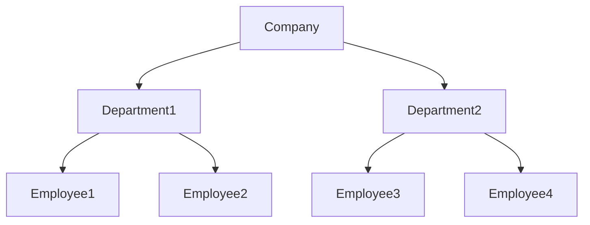

# Assignments - Database Management System
## 1. Explain Different data models with an Example
Data models are conceptual representations of how data is organized and structured. They provide a blueprint for storing, managing, and retrieving data in a database or data storage system. There are several types of data models, each with its strengths and weaknesses. Here are some common data models with examples:
- Relational Data Model
- Hierarchical Data Model
- Network Data Model

### Relational Data Model
A relational data model organizes data into tables with well-defined relationships between them. Each table has rows and columns, where each row represents a single record and each column represents a field or attribute of that record.

**Students Table**

| StudentID (Primary Key) | Name | Age | DepartmentID (Foreign Key) |
| --- | --- | --- | --- |
| 1 | John Doe | 20 | 1 |
| 2 | Jane Smith | 22 | 2 |
| 3 | Bob Johnson | 21 | 1 |

**Courses Table**

| CourseID (Primary Key) | CourseName | DepartmentID (Foreign Key) |
| --- | --- | --- |
| 1 | Math 101 | 1 |
| 2 | Science 202 | 2 |
| 3 | History 303 | 1 |

### Hierarchical Data Model
A hierarchical data model organizes data into a tree-like structure, with each node representing a record or a group of records.

**Company**

### Network Data Model
A network data model organizes data into a graph structure, with each node representing a record or a group of records, and edges representing relationships between them.

- [ThoughtSpot](https://www.thoughtspot.com/data-trends/data-modeling/types-of-data-models)

## 2. What is An ER Diagram? Write its notation and draw ER diagram for Library Management System
An Entity Relationship (ER) Diagram is a type of flowchart that illustrates how “entities” such as people, objects or concepts relate to each other within a system.

Refer to:
- [EDrawMax](https://www.edrawmax.com/article/er-diagram-symbols-and-notations.html)
- [Simplilearn](https://www.simplilearn.com/tutorials/sql-tutorial/er-diagram-in-dbms)

Diagram: [Link](library-er-diagram.svg)
