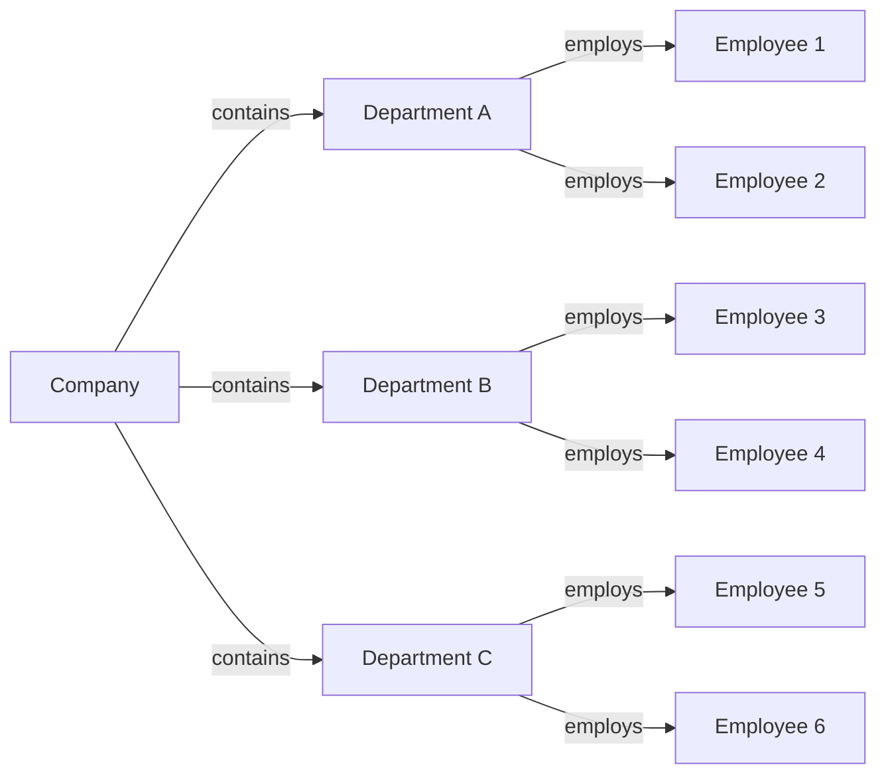

# Unit 1: Database Architecture

## Important Questions

### Q1. define database.

A database is a collection of data that is structured and easy to access, manage and update. This can be anything like text, numbers, videos, images, files, and more.

### Q2. Define DBMS

A DBMS(Database Management System) is a software used to manage data in a database. This allows us to store, modify, update and delete data from a database.

Examples: MySQL, Oracle SQL, MongoDB, PostgreSQL, etc

[GeeksForGeeks](https://www.geeksforgeeks.org/dbms/)

### Q3. Why do we need DBMS?

A DBMS makes the following tasks a lot simpler:
- Data Organization and Management
    - A well-designed database schema enables faster access to information, reducing the time required to find relevant data. 
    - A DBMS also provides features like indexing and searching, which make it easier to locate specific data within the database. 
- Data Security and Privacy
    - They offer authentication and authorization features that control access to the database. 
    - DBMSs also provide encryption capabilities to protect sensitive data from unauthorized access. 
- Data Integrity and Consistency
    - DBMSs provide mechanisms that ensure the accuracy and consistency of data. 
    - These mechanisms include constraints, triggers, and stored procedures that enforce data integrity rules
- Concurrent Data Access
    - DBMS provides a concurrent access mechanism that allows multiple users to access the same data simultaneously.
    - DBMSs use locking mechanisms to ensure that multiple users can access the same data without causing conflicts or data corruption.

[GeeksForGeeks](https://www.geeksforgeeks.org/need-for-dbms/)
### Q4. Define data model.
A Data Model is a blueprint-like representation of the data so that we can visualize and understand it.

[AWS](https://aws.amazon.com/what-is/data-modeling/#:~:text=Data%20modeling%20is%20the%20process,store%20and%20analyze%20the%20data.)
### Q5. Explain relational model.
A relational data model is where we use Tables to describe how our data is stored in a Relational Databases. Rows are called Tuples and Columns are called Attributes.  

| **Student ID** | **Name** | **Age** | **Field** |
| --- | --- | --- | --- |
| 1 | John Smith | 20 | Computer Science |
| 2 | Jane Doe | 21 | Biology |
| 3 | Bob Johnson | 19 | Mathematics |

Here, Student ID, Name, Age and Field come under Attributes(columns) and the Tuples(rows) hold student data corresponding to the attributes. 

[GeeksForGeeks](https://www.geeksforgeeks.org/relational-model-in-dbms/)

### Q6. Explain Hierarchical model.
In a hierarchical model, data is organized in a tree-like structure which helps group multiple tables together.

Here, Company is the root node, The departments are parent nodes and the employees are the child nodes.

- Node: A single entity or record in the hierarchical structure.
- Parent node: The node that is one level above a given node in the hierarchical structure.
- Child node: The node that is one level below a given node in the hierarchical structure.
- Root node: The topmost node in the hierarchical structure.

[GeeksForGeeks](https://www.geeksforgeeks.org/hierarchical-model-in-dbms/)

### Q7. What is a schema?
A database schema is basically the structure of the relational database, so it defines how the data is organized.

This includes primary key, tuples, attributes, tables, fields, data types, relations and constraints.

[GeeksForGeeks](https://www.geeksforgeeks.org/database-schemas/)

[IBM](https://www.ibm.com/topics/database-schema)
### Q8. What is an instance?
A Database instance is the collection of all the data stored at any given time. This is also called the current state, or database state. 

[GeeksForGeeks](https://www.geeksforgeeks.org/instance-in-database)
### Q9. What is DBMS architecture?
A DBMS (Database Management System) architecture refers to the overall design and organization of a DBMS, including the components, interfaces, and interactions between them. It provides a framework for managing and accessing data in a database.

[Javatpoint](https://www.javatpoint.com/dbms-architecture)
### Q10. What is data independence?
Data independence is a property of a database management system by which we can change the database schema at one level of the database system without changing the database schema at the next higher level. 

It has two types:
- Physical Data Independence 
- Logical Data Independence

[GeeksForGeeks](https://www.geeksforgeeks.org/what-is-data-independence-in-dbms/)
### Q11. Define database language.
Database Language is a programming language used to define and manipulate a database.

It has 4 types based on what it does:
- DDL - Data Definition Language
    - CREATE
    - ALTER
    - DROP
    - TRUNCATE
    - COMMENT
    - RENAME
- DML - Data Manipulation Language
    - INSERT
    - UPDATE
    - DELETE
    - MERGE
    - CALL
- DQL - Data Query Language 
    - SELECT
- DCL - Data Control Language
    - GRANT
    - REVOKE
- TCL - Transaction Control Language
    - COMMIT
    - ROLLBACK
    - SAVEPOINT
    - AUTOCOMMIT

[Scalar](https://www.scaler.com/topics/database-languages-in-dbms/)
### Q12. What are the properties of database?
- **Data Independence**: Separation of data storage from application programs, allowing changes without affecting functionality.

- **Data Integrity**: The data should be correct and without any inconsistencies. To ensure data integrity, the database system uses data validation procedures that define acceptable input range for each field in the record.

- **Data Redundancy and Inconsistency**: Reduces duplicate data and ensures efficient storage.

- **Data Sharing and Security**: Facilitates sharing of data among multiple users and applications. It should be accessible to authorized users only.

### Q13. Explain different types of database users.
1. **Database Administrators (DBA)**: Responsible for implementing and managing the database system, including:
   - Defining and modifying schema.
   - Managing storage structure and access methods.
   - Creating security measures and user privileges.
   - Defining integrity constraints.
   - Establishing backup and recovery policies.

2. **Database Designers**: Design the database structure, including tables, indexes, views, and stored procedures, determining how data is stored and related.

3. **End Users**: Access the database for querying and reporting, categorized as:
   - **Casual Users**: Access the database occasionally for different information.
   - **Naive Users**: Unsophisticated users who interact via application interfaces without database knowledge.
   - **Sophisticated Users**: Familiar with databases, write SQL queries for their needs.
   - **Stand-alone Users**: Maintain personal databases using ready-made software.

### Q14. What are the disadvantages of database?
1. **Increased Cost**:
   - **Hardware and Software**: DBMS requires high-speed processors and large memory, leading to significant costs for hardware and software. Maintenance and licensing add to these expenses.
   - **Staff Training**: Hiring and training educated staff (DBAs, programmers) increases costs, as does outsourcing to software houses.
   - **Data Conversion**: Transitioning existing data to a DBMS involves high expenses for hiring designers and developers.

2. **Complexity**: DBMS functionality requires in-depth knowledge from developers, DBAs, and end-users. Lack of expertise can lead to data loss and poor design decisions, making management challenging.

3. **Currency Maintenance**: Keeping the system updated for efficiency is crucial. Regular updates and security measures incur additional training costs.

4. **Performance**: DBMS may perform poorly for small organizations compared to traditional file systems, leading to slower application speeds and reduced usability.

5. **Frequent Upgrade/Replacement Cycles**: New functionality and software upgrades often require hardware updates, making it difficult for users to adapt to constant changes and incurring training costs.

6. **Complex Design**: Database design is intricate, time-consuming, and requires significant effort.

7. **Damaged Parts**: Corruption in one part of the database can affect the entire system.

8. **Compatibility**: DBMS software may not integrate well with other systems, complicating application development.

9. **Security**: Vulnerabilities can arise if the DBMS is not properly configured, risking data loss or theft.

10. **Data Isolation**: Scattered data across various files complicates the retrieval of relevant information.

11. **Difficulty in Accessing Data**: Conventional file-processing systems may lack the necessary application programs for specific queries, leading to inefficiencies.

12. **Data Redundancy and Inconsistency**: Multiple versions of the same data in different files can lead to inconsistencies and higher storage costs.

13. **Integrity Problems**: Enforcing consistency constraints can be challenging, especially when multiple data items are involved, complicating program updates.

[GeeksforGeeks](https://www.geeksforgeeks.org/disadvantages-of-dbms/)

### Q15. Explain different people in DBMS.
Refer Answer 13.

### Q17. Explain different types of schemas.

1. **Physical Database Schema**:
   - Defines how data is physically stored in storage systems, including files and indices.
   - Involves the actual code and syntax for creating the database structure.
   - The Database Administrator determines where and how to store data in storage blocks.

2. **Logical Database Schema**:
   - Describes logical constraints, tables, views, entity relationships, and integrity constraints.
   - Illustrates how data is organized in tables and the connections between attributes.
   - Maintains relationships using ER modeling and enforces integrity constraints for data quality.

3. **View Database Schema**:
   - Represents the interaction design between end-users and the database.
   - Allows users to interact with the database through an interface without needing to understand the underlying data storage mechanisms.

[GeeksforGeeks](https://www.geeksforgeeks.org/database-schemas/)

### Q18. Explain different types of DBMS architectures.
1. **Client-Server Architecture**:
The design of a DBMS depends on its architecture. It can be centralized or decentralized or hierarchical. Database architecture is logically divided into two types. They are:
   - **Two-tier Client/Server Architecture**:
     - Consists of a user interface program and application programs on the client side.
     - Uses ODBC (Open Database Connectivity) to connect client programs to the DBMS.
     - Requests are sent from the application layer to the database layer, and results are returned to the application layer.

   - **Three-tier Client/Server Architecture**:
     - Separates tiers based on user complexity and data usage.
     - Most widely used architecture for designing a DBMS.

2. **Centralized DBMS Architecture**:
   - Features a database stored and maintained in a single location (e.g., a server or mainframe).
   - Commonly used by organizations or institutions, such as businesses and universities.

### Q19. What is database Representation? Explain different types with examples
Database representation refers to how data is structured, organized, and stored in a database. Different types of representations help in modeling and accessing data effectively. Here are the main types:

1. **Flat File Representation**:
   - Data is stored in a single table or file, with records arranged in rows and fields in columns.
   - **Example**: A CSV file containing student records with fields like Name, Age, and Grade.

2. **Hierarchical Representation**:
   - Organizes data in a tree-like structure where each record has a single parent and can have multiple children.
   - **Example**: An organizational chart where a manager has multiple employees reporting to them.

3. **Network Representation**:
   - Similar to hierarchical but allows multiple parent-child relationships, forming a graph structure.
   - **Example**: A social network where users can have multiple friends and connections.

4. **Relational Representation**:
   - Data is organized into tables (relations) with rows (records) and columns (attributes). Relationships between tables are established through foreign keys.
   - **Example**: A database with a "Students" table and a "Courses" table, linked by a Course ID.

5. **Object-oriented Representation**:
   - Data is represented as objects, similar to programming languages, encapsulating both data and behavior.
   - **Example**: An object representing a car that includes properties like make, model, and methods for starting or stopping.

6. **Document Representation**:
   - Data is stored in semi-structured formats, often using JSON or XML, suitable for hierarchical data.
   - **Example**: A JSON document representing a blog post with fields like title, author, and content.

7. **Graph Representation**:
   - Data is represented as nodes and edges, allowing complex relationships and queries.
   - **Example**: A graph database representing a network of cities connected by roads, where cities are nodes and roads are edges.

### Q20. What is the difference between logical and physical data independence? Explain briefly.
**Logical Data Independence**:
- Refers to the capacity to change the logical schema without altering the external schema or application programs.
- Changes may include adding new fields or tables.
- Allows users to interact with data without needing to modify their applications when the logical structure changes.

**Physical Data Independence**:
- Refers to the ability to change the physical schema without affecting the logical schema.
- Changes may involve altering storage devices, file formats, or indexing methods.
- Ensures that the logical structure remains stable even if the physical storage changes.

### Summary
- **Logical Independence**: Changes in the logical structure don't affect user applications.
- **Physical Independence**: Changes in physical storage don't affect the logical structure.

## Source:
- Questions: Dictated in class